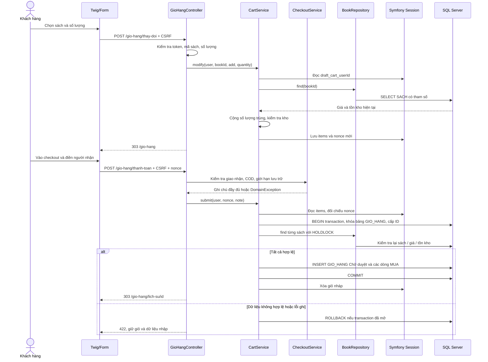

# Sequence · Thêm sách và đặt hàng

```mermaid
sequenceDiagram
    actor Customer as Khách hàng
    participant UI as Twig/Form
    participant Controller as GioHangController
    participant Cart as CartService
    participant Checkout as CheckoutService
    participant Books as BookRepository
    participant Session as Symfony Session
    participant DB as SQL Server

    Customer->>UI: Chọn sách và số lượng
    UI->>Controller: POST /gio-hang/thay-doi + CSRF
    Controller->>Controller: Kiểm tra token, mã sách, số lượng
    Controller->>Cart: modify(user, bookId, add, quantity)
    Cart->>Session: Đọc draft_cart_userId
    Cart->>Books: find(bookId)
    Books->>DB: SELECT SACH có tham số
    DB-->>Cart: Giá và tồn kho hiện tại
    Cart->>Cart: Cộng số lượng trùng, kiểm tra kho
    Cart->>Session: Lưu items và nonce mới
    Controller-->>UI: 303 /gio-hang
    Customer->>UI: Vào checkout và điền người nhận
    UI->>Controller: POST /gio-hang/thanh-toan + CSRF + nonce
    Controller->>Checkout: Kiểm tra giao nhận, COD, giới hạn lưu trữ
    Checkout-->>Controller: Ghi chú đầy đủ hoặc DomainException
    Controller->>Cart: submit(user, nonce, note)
    Cart->>Session: Đọc items, đối chiếu nonce
    Cart->>DB: BEGIN transaction, khóa bảng GIO_HANG, cấp ID
    Cart->>Books: find từng sách với HOLDLOCK
    Books->>DB: Kiểm tra lại sách / giá / tồn kho
    alt Tất cả hợp lệ
        Cart->>DB: INSERT GIO_HANG Chờ duyệt và các dòng MUA
        Cart->>DB: COMMIT
        Cart->>Session: Xóa giỏ nháp
        Controller-->>UI: 303 /gio-hang/lich-su/id
    else Dữ liệu không hợp lệ hoặc lỗi ghi
        Cart->>DB: ROLLBACK nếu transaction đã mở
        Controller-->>UI: 422, giữ giỏ và dữ liệu nhập
    end
```

Admin duyệt là transaction khác, kiểm tra trạng thái và tồn kho lần nữa rồi mới trừ kho. Việc thêm sách hoặc gửi giỏ không giữ chỗ trong kho.
